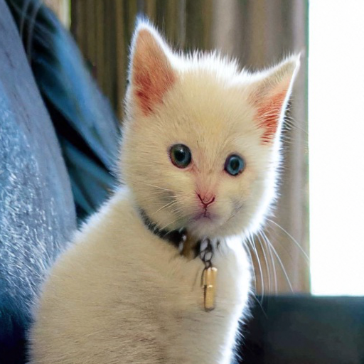

# stabilityai/stable-diffusion-x4-upscaler Cog model

This is an implementation of [stabilityai/stable-diffusion-x4-upscaler](https://huggingface.co/stabilityai/stable-diffusion-x4-upscaler) as a [Cog](https://github.com/replicate/cog) model.

## Development

Follow the [model pushing guide](https://replicate.com/docs/guides/push-a-model) to push your own model to [Replicate](https://replicate.com).

## Basic Usage

Run a prediction:

    cog predict -i image=@demo.png

## Example Input

## Output

